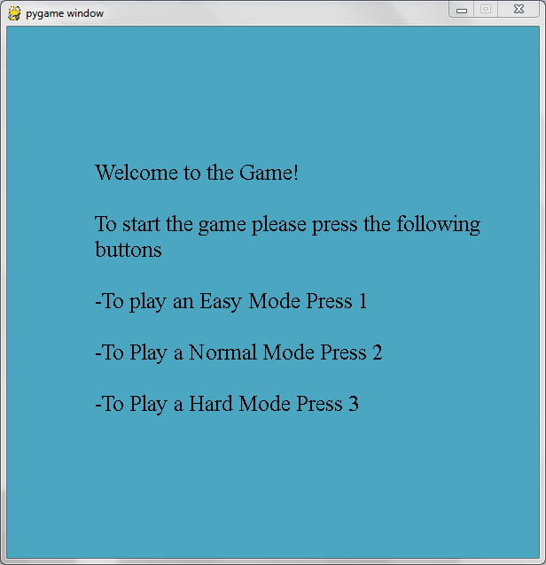

# ColorStealthGame 
## The Purpose of the Game
The game is created for two players. The approximate time of the game variates from 1 till 5 minutes, depending on the selected level (Easy, Normal and Hard)

The goal is to find your game partner in the environment of chaos and mess.

## Installation

Installation can be done through pip:

```bash
    pip install ColorStealthGame
```

... or by running the setup.py file directly:

```bash
    git clone https://github.com/AnnaD1992/ColorStealthGame
    cd ColorStealthGame
    python setup.py install
```

## Runnign the game

In the terminal, run the game by simply typing the **colorgame** command:

```bash
colorgame
```

## How to Play

For starting the game the players need to press a <strong>Space</strong> button.

The game has 3 levels: Easy, Normal and Hard. To select the level the players need to press the following buttons: 
- Button 1 - for the Easy Mode
- Button 2 - for the Normal Mode
- Button 3 - for the Hard Mode




For playing this game, you need a keyboard and the following buttons:
- Up and W buttons are for moving up
- Down and S buttons are for moving down
- Left and A buttons are for moving left
- Right and D buttons are for moving right

For quitting the game, the players need to press the <strong>ESC</strong> button

## The end of the game

At the end of the game, the players can start over by pressing the <strong>Space</strong> Button

## Authors
Nicholas Del Grosso,
Anna Durbanova
